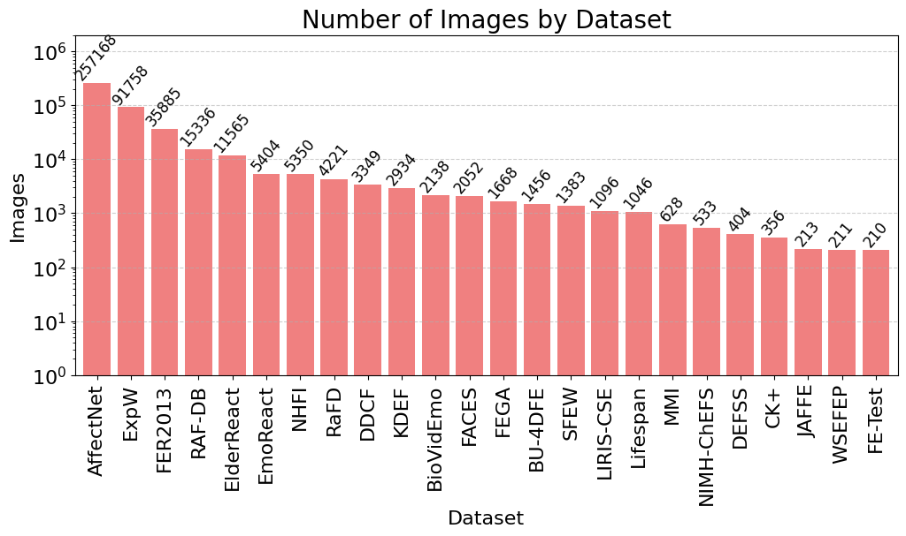
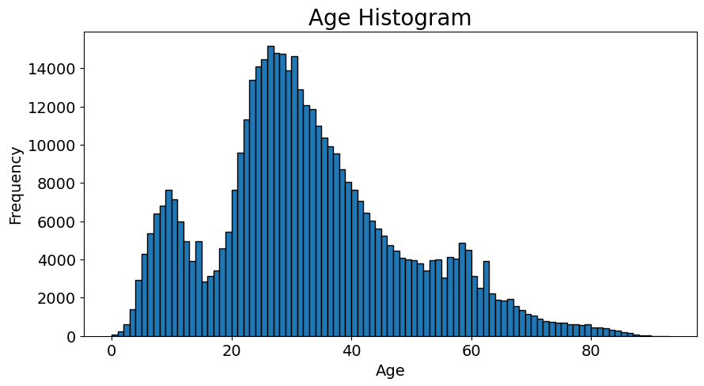
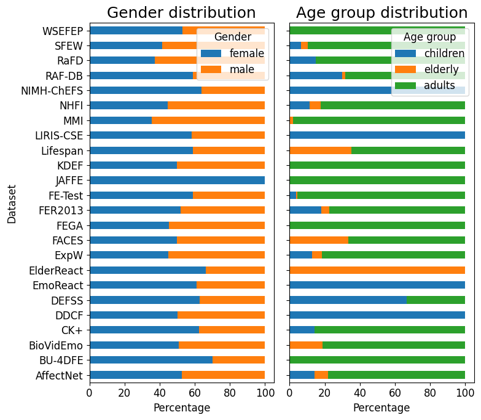
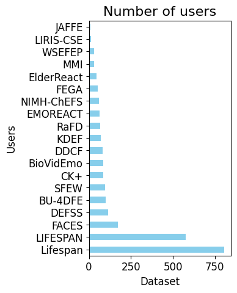
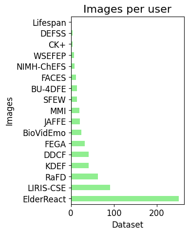
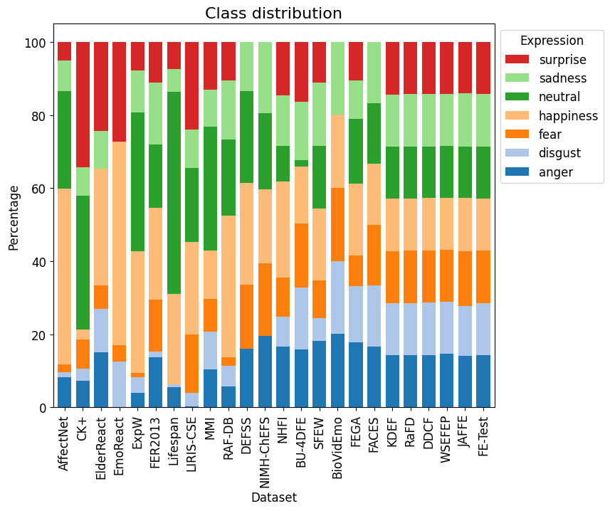
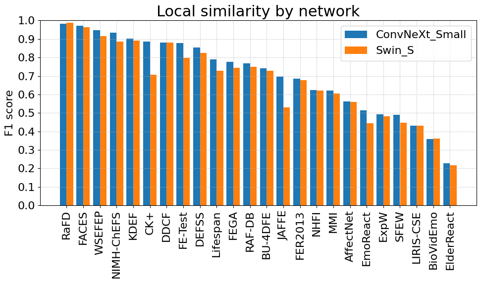
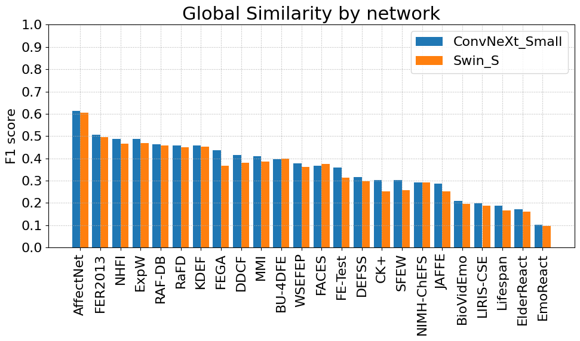
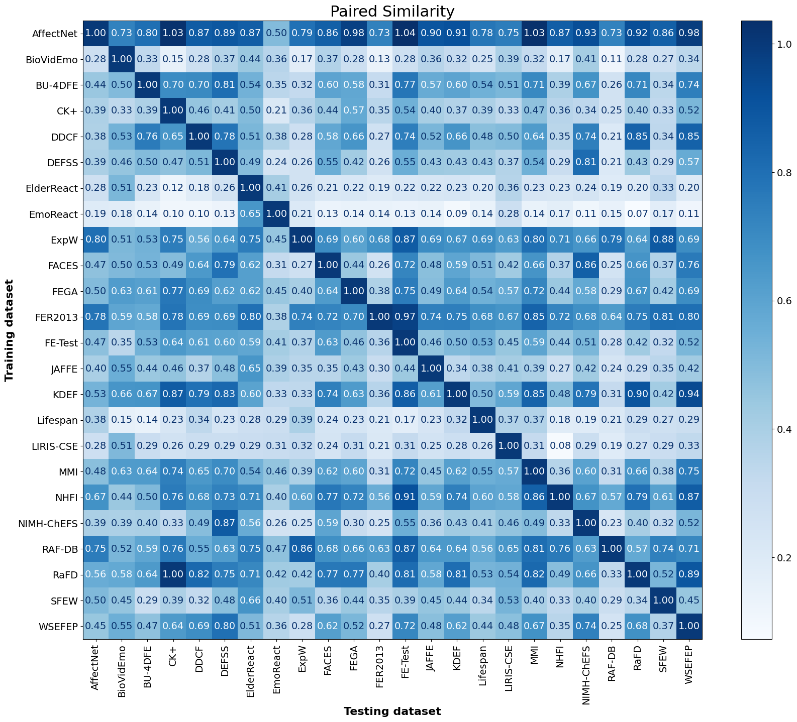

# fer_benchmark

**Authors:** F. Xavier Gaya-Morey, Cristina Manresa-Yee, Celia Martinie, Jose M. Buades-Rubio

This repository contains the complete code used in the scientific article titled *"Evaluating Facial Expression Recognition Datasets for Deep Learning: A Benchmark Study"*.

## Abstract
This study investigates the key characteristics and suitability of widely used Facial Expression Recognition (FER) datasets for training deep learning models. In the field of affective computing, FER is essential for interpreting human emotions, yet the performance of FER systems is highly contingent on the quality and diversity of the underlying datasets. To address this issue, we compiled and analyzed 24 FER datasets--including those targeting specific age groups such as children, adults, and the elderly--and processed them through a comprehensive normalization pipeline. In addition, we enriched the datasets with automatic annotations for age and gender, enabling a more nuanced evaluation of their demographic properties. To further assess dataset efficacy, we introduce three novel metrics--Local, Global, and Paired Similarity--which quantitatively measure dataset difficulty, generalization capability, and cross-dataset transferability. Benchmark experiments using state-of-the-art neural networks reveal that large-scale, automatically collected datasets (e.g., AffectNet, FER2013) tend to generalize better, despite issues with labeling noise and demographic biases, whereas controlled datasets offer higher annotation quality but limited variability. Our findings provide actionable recommendations for dataset selection and design, advancing the development of more robust, fair, and effective FER systems.


## Install

To install the project, follow these steps:

1. First install [YOLOv8](https://github.com/ultralytics/ultralytics), [SPIGA](https://github.com/andresprados/SPIGA), and [MiVOLO](https://github.com/WildChlamydia/MiVOLO) if you want to run face detection, head-pose estimation or age-gender estimation, respectively (needed only in notebooks [1 - Unify datasets](notebooks/1%20-%20Unify%20datasets.ipynb) and [3- Preprocess](notebooks/3%20-%20Preprocess.ipynb)).

2. Clone the repository:
    ```sh
    git clone https://github.com/Xavi3398/fer_benchmark.git
    ```

3. Navigate to the project directory:
    ```sh
    cd fer_benchmark
    ```

4. Install the required dependencies:
    ```sh
    pip install -r requirements.txt
    ``` 

## Usage

The project is structured into three main folders:
* [notebooks](notebooks): contains all Jupyter notebooks used to normalize each dataset, preprocess them, train the neural networks, and compute the three similarity metrics (Local, Global, and Paired Similarities).
* [labels](labels): contains the separated labels for the [24 datasets](labels/datasets-labels) used in the benchmark in a standardized format, and the [merged labels](labels/24-datasets.csv) after image exclussion and processing.
* [weights](weights): weights used for the three deep learning models used for face detection ([YOLOv8](https://github.com/ultralytics/ultralytics)), facial landmarks and head-pose estimation ([SPIGA](https://github.com/andresprados/SPIGA)), and age-gender estimation ([MiVOLO](https://github.com/WildChlamydia/MiVOLO)). They should be downloaded apart from each source.

## Datasets included in the benchmark

| **Dataset** | **Year** | **Users** | **Ages** | **Type** | **Samples** | **Anger** | **Disgust** | **Fear** | **Happiness** | **Sadness** | **Surprise** | **Neutral** |
|-------------|----------|-----------|----------|----------|-------------|:-----------:|:-------------:|:----------:|:---------------:|-------------:|:--------------:|:-------------:|
| FEGA        | 2022     | 51        | 21-66    | Image    | 2,856       | &check;   | &check;     | &check;  | &check;       | &check;     | &check;      | &check;     |
| FE-Test     | 2022     | N/A       | N/A      | Image    | 210         | &check;   | &check;     | &check;  | &check;       | &check;     | &check;      | &check;     |
| NHFI        | 2020     | N/A       | N/A      | Image    | 5,558       | &check;   | &check;     | &check;  | &check;       | &check;     | &check;      | &check;     |
| ElderReact  | 2019     | 46        | N/A      | Video    | 1,323       | &check;   | &check;     | &check;  | &check;       | &check;     | &check;      |             |
| LIRIS-CSE   | 2019     | 12        | 4-12     | Video    | 208         | &check;   | &check;     | &check;  | &check;       | &check;     | &check;      |             |
| ExpW        | 2018     | N/A       | N/A      | Image    | 91,793      | &check;   | &check;     | &check;  | &check;       | &check;     | &check;      | &check;     |
| AffectNet   | 2017     | N/A       | N/A      | Image    | 440,000     | &check;   | &check;     | &check;  | &check;       | &check;     | &check;      | &check;     |
| DEFSS       | 2017     | 116       | 8-30     | Image    | 404         | &check;   |             | &check;  | &check;       | &check;     |              | &check;     |
| RAF-DB      | 2017     | N/A       | 0-70     | Image    | 29,672      | &check;   | &check;     | &check;  | &check;       | &check;     | &check;      | &check;     |
| BioVidEmo   | 2016     | 90        | 18-65    | Video    | 430         | &check;   | &check;     | &check;  | &check;       | &check;     |              |             |
| EmoReact    | 2016     | 63        | 4-14     | Video    | 1,102       |           | &check;     | &check;  | &check;       |             | &check;      |             |
| WSEFEP      | 2014     | 30        | 20-30    | Image    | 210         | &check;   | &check;     | &check;  | &check;       | &check;     | &check;      | &check;     |
| DDCF        | 2013     | 80        | 6-16     | Image    | 6,366       | &check;   | &check;     | &check;  | &check;       | &check;     | &check;      | &check;     |
| FER2013     | 2013     | N/A       | N/A      | Image    | 35,887      | &check;   | &check;     | &check;  | &check;       | &check;     | &check;      | &check;     |
| NIMH-ChEFS  | 2011     | 59        | 10-17    | Image    | 482         | &check;   |             | &check;  | &check;       | &check;     |              | &check;     |
| SFEW        | 2011     | 95        | 1-70     | Image    | 700         | &check;   | &check;     | &check;  | &check;       | &check;     | &check;      | &check;     |
| CK+         | 2010     | 123       | 18-50    | Video    | 593         | &check;   | &check;     | &check;  | &check;       | &check;     | &check;      | &check;     |
| FACES       | 2010     | 171       | 19-80    | Image    | 2,052       | &check;   | &check;     | &check;  | &check;       | &check;     | &check;      |             |
| RaFD        | 2010     | 67        | N/A      | Image    | 8,040       | &check;   | &check;     | &check;  | &check;       | &check;     | &check;      | &check;     |
| BU-4DFE     | 2008     | 101       | 18-45    | Video    | 606         | &check;   | &check;     | &check;  | &check;       | &check;     | &check;      |             |
| MMI         | 2005     | 75        | 19-62    | Video    | 2,900       | &check;   | &check;     | &check;  | &check;       | &check;     | &check;      |             |
| Lifespan    | 2004     | 576       | 18-93    | Image    | 1,354       | &check;   | &check;     |          | &check;       | &check;     | &check;      | &check;     |
| KDEF        | 1998     | 70        | 20-30    | Image    | 4,900       | &check;   | &check;     | &check;  | &check;       | &check;     | &check;      | &check;     |
| JAFFE       | 1997     | 10        | N/A      | Image    | 219         | &check;   | &check;     | &check;  | &check;       | &check;     | &check;      | &check;     |

### Basic characteristics of the datasets

<div width="100%">
     
    
</div>

<div width="100%">
     
     
     
</div>




### Benchmark results

<!-- | **Dataset** | **Local <br> Similarity** | **Global <br> Similarity** |
|-------------|:----------------------:|:-----------------------:|
| AffectNet   | 0.5622               | 0.6095                |
| BioVidEmo   | 0.3603               | 0.2030                |
| BU-4DFE     | 0.7348               | 0.3981                |
| CK+         | 0.7963               | 0.2771                |
| DDCF        | 0.8797               | 0.3978                |
| DEFSS       | 0.8395               | 0.3058                |
| ElderReact  | 0.2224               | 0.1667                |
| EmoReact    | 0.4806               | 0.0994                |
| ExpW        | 0.4882               | 0.4782                |
| FACES       | 0.9681               | 0.3707                |
| FEGA        | 0.7606               | 0.4017                |
| FER2013     | 0.6807               | 0.5008                |
| FE-Test     | 0.8384               | 0.3368                |
| JAFFE       | 0.6129               | 0.2686                |
| KDEF        | 0.8966               | 0.4551                |
| Lifespan    | 0.7587               | 0.1769                |
| LIRIS-CSE   | 0.4318               | 0.1934                |
| MMI         | 0.6130               | 0.3977                |
| NHFI        | 0.6229               | 0.4773                |
| NIMH-ChEFS  | 0.9107               | 0.2916                |
| RAF-DB      | 0.7578               | 0.4601                |
| RaFD        | 0.9849               | 0.4539                |
| SFEW        | 0.4681               | 0.2795                |
| WSEFEP      | 0.9314               | 0.3695                | -->

<div width="100%">
    
    
    
</div>

## Acknowledgements

This work is part of the Project PID2023-149079OB-I00 (EXPLAINME) funded by MICIU/AEI/10.13039/ 501100011033/ and FEDER, EU and of Project PID2022-136779OB-C32 (PLEISAR) funded by MICIU/ AEI /10.13039/501100011033/ and FEDER, EU. 

F. X. Gaya-Morey was supported by an FPU scholarship from the Ministry of European Funds, University and Culture of the Government of the Balearic Islands.

## Citing

```
@misc{gaya-morey2025evaluating,
	title         = {Evaluating Facial Expression Recognition Datasets for Deep Learning: A Benchmark Study},
	author        = {F. Xavier Gaya-Morey and Cristina Manresa-Yee and Celia Martinie and Jose M. Buades-Rubio},
	year          = 2025
}
```

## License

This project is licensed under the MIT License - see the [LICENSE](LICENSE.TXT) file for details.

## Contact

If you have any questions or feedback, please feel free to contact the authors.
